# Content Strategy v2.0: Topic Clusters & Editorial Planning

Comprehensive framework for strategic content planning, topic cluster architecture, content scoring, and systematic editorial operations.

## Table of Contents

1. [Topic Cluster Architecture](#topic-cluster-architecture)
2. [Pillar & Cluster Content Model](#pillar--cluster-content-model)
3. [Content Scoring Matrix](#content-scoring-matrix)
4. [Editorial Calendar Framework](#editorial-calendar-framework)
5. [Content Gap Analysis](#content-gap-analysis)
6. [Content Repurposing System](#content-repurposing-system)
7. [Content Audit Checklist](#content-audit-checklist)

---

## Topic Cluster Architecture

### Cluster Strategy Framework

**Core Cluster Structure:**
```
Pillar Content (Hub)
├── Primary Keyword Target
├── 3,000+ word comprehensive guide
├── High search volume & commercial intent
├── Links to all cluster content
└── Updated quarterly

Supporting Cluster Content (Spokes)
├── Long-tail keyword targets
├── 1,500-2,500 word focused articles
├── Specific subtopics within pillar theme
├── Link back to pillar content
└── Updated as needed
```

**Cluster Mapping Template:**
```yaml
Pillar: "Content Marketing Strategy"
Primary Keyword: "content marketing strategy" (8,100/month)
URL: /content-marketing-strategy/

Cluster Topics:
  1. Content Planning:
     - "content marketing plan template" (1,200/month)
     - "content marketing planning process" (800/month)
     - URL: /content-marketing-plan/
  
  2. Editorial Calendar:
     - "editorial calendar template" (2,400/month)
     - "content calendar best practices" (600/month)
     - URL: /editorial-calendar-guide/
  
  3. Content Distribution:
     - "content distribution strategy" (1,800/month)
     - "content promotion channels" (400/month)
     - URL: /content-distribution-strategy/

  4. Performance Measurement:
     - "content marketing metrics" (1,600/month)
     - "content marketing ROI" (900/month)
     - URL: /content-marketing-metrics/
```

### Cluster Research & Validation

**Keyword Research for Clusters:**
```python
def analyze_topic_cluster(pillar_keyword, related_keywords):
    """Analyze keyword relationships for cluster potential"""
    
    cluster_data = {
        'pillar': {
            'keyword': pillar_keyword,
            'search_volume': get_search_volume(pillar_keyword),
            'difficulty': get_keyword_difficulty(pillar_keyword),
            'intent': classify_intent(pillar_keyword)
        },
        'clusters': []
    }
    
    for keyword in related_keywords:
        cluster_data['clusters'].append({
            'keyword': keyword,
            'search_volume': get_search_volume(keyword),
            'difficulty': get_keyword_difficulty(keyword),
            'semantic_relationship': calculate_semantic_similarity(pillar_keyword, keyword),
            'content_gap': analyze_content_gap(keyword)
        })
    
    return prioritize_cluster_opportunities(cluster_data)

# Example usage
pillar = "content marketing strategy"
related = [
    "content marketing plan",
    "editorial calendar",
    "content distribution",
    "content marketing metrics",
    "content repurposing"
]

cluster_analysis = analyze_topic_cluster(pillar, related)
```

**Cluster Validation Criteria:**
```
✓ Semantic relationship to pillar topic (>70% relevance)
✓ Search volume potential (>500 monthly searches)
✓ Manageable keyword difficulty (<50 for new domains)
✓ Clear search intent alignment
✓ Content differentiation opportunity
✓ Business objective alignment
✓ Resource availability for quality execution
```

---

## Pillar & Cluster Content Model

### Pillar Content Framework

**Pillar Page Structure:**
```markdown
# Ultimate Guide to [Pillar Topic]
## Table of Contents (with jump links)

## Quick Navigation
- [Subtopic 1] → Link to cluster content
- [Subtopic 2] → Link to cluster content  
- [Subtopic 3] → Link to cluster content
- [Resources & Tools]

## Introduction
- Problem/opportunity definition
- What readers will learn
- Why this matters now

## Core Sections (3-5 major sections)
### Section 1: Foundation Knowledge
- Comprehensive explanation
- Examples and case studies
- Link to related cluster content: "Learn more about [specific aspect]"

### Section 2: Strategic Framework  
- Step-by-step methodology
- Templates and tools
- Link to cluster content for deeper dives

### Section 3: Implementation Guide
- Practical steps and tactics
- Common mistakes to avoid
- Links to supporting cluster content

### Section 4: Measurement & Optimization
- Key metrics and KPIs
- Optimization strategies
- Link to metrics-focused cluster content

## Key Takeaways
- 5-7 bullet point summary
- Next steps and recommendations

## Related Resources
- Links to all cluster content
- External tools and resources
- Downloadable templates

## FAQ Section
- 8-10 common questions
- Schema markup for featured snippets
```

**Pillar Content Example:**
```html
<!-- Content Marketing Strategy Pillar -->
<article>
  <h1>Content Marketing Strategy: Complete Guide for 2024</h1>
  
  <div class="pillar-nav">
    <h2>Quick Navigation</h2>
    <ul>
      <li><a href="#content-planning">Content Planning</a> 
          → <a href="/content-marketing-plan/">Detailed Planning Guide</a></li>
      <li><a href="#editorial-calendar">Editorial Calendar</a> 
          → <a href="/editorial-calendar-guide/">Calendar Templates</a></li>
      <li><a href="#distribution">Content Distribution</a> 
          → <a href="/content-distribution-strategy/">Distribution Playbook</a></li>
    </ul>
  </div>

  <section id="content-planning">
    <h2>Content Planning Framework</h2>
    <p>Strategic content planning involves audience research, competitive analysis, 
       and systematic topic development...</p>
    <div class="cluster-link">
      🔗 <strong>Deep Dive:</strong> <a href="/content-marketing-plan/">
         Complete Content Planning Template and Process</a>
    </div>
  </section>
</article>
```

### Cluster Content Strategy

**Cluster Content Types:**
```
How-To Guides:
- "How to create a content marketing plan"
- "How to build an editorial calendar"
- Step-by-step instructions
- 1,500-2,000 words

Comparison Articles:
- "Content marketing vs. traditional marketing"
- "Best content calendar tools comparison"
- Feature comparisons and recommendations
- 1,200-1,800 words

Template/Resource Posts:
- "Content marketing plan template"
- "Editorial calendar templates"
- Downloadable resources
- 800-1,200 words + resource

Case Studies:
- "How [Company] increased traffic 300% with content clusters"
- Real examples and data
- 1,000-1,500 words
```

**Cluster Interlinking Strategy:**
```html
<!-- Cluster page linking back to pillar -->
<div class="pillar-reference">
  <p>This guide is part of our comprehensive 
     <a href="/content-marketing-strategy/">Content Marketing Strategy</a> 
     resource. For the complete framework, start with our pillar guide.</p>
</div>

<!-- Pillar page linking to clusters -->
<div class="cluster-links">
  <h3>Related Guides in This Series:</h3>
  <ul>
    <li><a href="/content-marketing-plan/">Content Planning Template</a></li>
    <li><a href="/editorial-calendar-guide/">Editorial Calendar Guide</a></li>
    <li><a href="/content-distribution-strategy/">Distribution Strategy</a></li>
  </ul>
</div>
```

---

## Content Scoring Matrix

### Content Evaluation Framework

**Content Quality Scoring (100 points total):**
```yaml
SEO Optimization (25 points):
  - Keyword optimization: 5 points
  - Meta tags and headers: 5 points  
  - Internal linking: 5 points
  - Technical SEO: 5 points
  - Schema markup: 5 points

Content Quality (30 points):
  - Depth and comprehensiveness: 10 points
  - Originality and uniqueness: 8 points
  - Examples and case studies: 7 points
  - Actionable insights: 5 points

User Experience (20 points):
  - Readability and structure: 8 points
  - Visual elements: 6 points
  - Loading speed: 3 points
  - Mobile optimization: 3 points

Engagement Potential (15 points):
  - Social sharing elements: 5 points
  - Call-to-action clarity: 5 points
  - Email capture integration: 5 points

Business Alignment (10 points):
  - Brand voice consistency: 5 points
  - Strategic objective support: 5 points
```

**Content Scoring Template:**
```python
def score_content(content_item):
    """Score content across multiple dimensions"""
    
    score = {
        'seo': {
            'keyword_optimization': score_keyword_optimization(content_item),
            'meta_tags': score_meta_tags(content_item), 
            'internal_links': score_internal_linking(content_item),
            'technical_seo': score_technical_elements(content_item),
            'schema_markup': score_schema_implementation(content_item)
        },
        'quality': {
            'depth': score_content_depth(content_item),
            'originality': score_content_originality(content_item),
            'examples': score_examples_case_studies(content_item),
            'actionability': score_actionable_insights(content_item)
        },
        'user_experience': {
            'readability': score_readability(content_item),
            'visual_elements': score_visual_design(content_item),
            'loading_speed': score_page_speed(content_item),
            'mobile_optimization': score_mobile_experience(content_item)
        },
        'engagement': {
            'social_elements': score_social_integration(content_item),
            'cta_clarity': score_call_to_action(content_item),
            'email_capture': score_lead_generation(content_item)
        },
        'business_alignment': {
            'brand_voice': score_brand_consistency(content_item),
            'strategic_fit': score_business_objectives(content_item)
        }
    }
    
    total_score = calculate_weighted_total(score)
    recommendations = generate_improvement_recommendations(score)
    
    return {
        'total_score': total_score,
        'category_scores': score,
        'grade': assign_letter_grade(total_score),
        'recommendations': recommendations
    }
```

### Content Performance Metrics

**Primary Performance Indicators:**
```yaml
Traffic Metrics:
  - Organic search traffic
  - Direct traffic
  - Referral traffic
  - Social media traffic

Engagement Metrics:
  - Average time on page
  - Bounce rate
  - Pages per session
  - Social shares
  - Comments and interactions

Conversion Metrics:
  - Email signups
  - Download completions
  - Contact form submissions
  - Product demo requests

SEO Performance:
  - Keyword ranking positions
  - SERP feature appearances
  - Click-through rates
  - Backlink acquisition

Business Impact:
  - Lead quality scores
  - Sales attribution
  - Customer acquisition cost
  - Lifetime value influence
```

---

## Editorial Calendar Framework

### Calendar Structure & Planning

**Monthly Editorial Calendar Template:**
```yaml
Month: March 2024
Theme: Content Marketing Mastery
Business Goal: Generate 200 qualified leads

Week 1 (Mar 1-7):
  Monday:
    Content: "Content Marketing Plan Template"
    Type: Resource/Template
    Target Keyword: "content marketing plan template"
    Author: Sarah Johnson
    Distribution: Blog, Email, LinkedIn, Twitter
    CTA: Download planning worksheet
    
  Wednesday:
    Content: "5 Content Planning Mistakes to Avoid"
    Type: List Article
    Target Keyword: "content planning mistakes"
    Author: Mike Chen
    Distribution: Blog, Social Media
    CTA: Subscribe to newsletter
    
  Friday:
    Content: "Content Planning Case Study: How Acme Corp Doubled Traffic"
    Type: Case Study
    Author: Sarah Johnson
    Distribution: Blog, LinkedIn Article
    CTA: Schedule consultation

Week 2 (Mar 8-14):
  [Similar structure continues...]

Repurposing Schedule:
  - Week 1 template → Social media graphics (4 posts)
  - Week 1 template → Email newsletter section
  - Week 2 case study → Podcast episode topic
  - Week 2 case study → Video summary
```

**Content Production Workflow:**

```mermaid
graph LR
    A[Idea Generation] --> B[Topic Research]
    B --> C[Keyword Analysis]
    C --> D[Content Brief Creation]
    D --> E[Writing Assignment]
    E --> F[First Draft]
    F --> G[Internal Review]
    G --> H[Revision & Editing]
    H --> I[SEO Optimization]
    I --> J[Visual Asset Creation]
    J --> K[Final Review]
    K --> L[Publication]
    L --> M[Distribution]
    M --> N[Performance Monitoring]
```


### Editorial Calendar Tools & Systems

**Airtable Editorial Calendar Setup:**
```javascript
// Airtable base structure for editorial calendar
const editorialCalendarFields = {
  'Content Title': 'Single line text',
  'Publication Date': 'Date',
  'Status': 'Single select', // Idea, Brief, Draft, Review, Complete, Published
  'Content Type': 'Single select', // Blog post, Email, Social, Video, etc.
  'Target Keywords': 'Multiple select',
  'Author': 'Single select',
  'Editor': 'Single select',
  'Topic Cluster': 'Single select',
  'Target Audience': 'Single select',
  'Business Goal': 'Single select',
  'Content Brief': 'Long text',
  'Word Count': 'Number',
  'SEO Score': 'Number',
  'Performance Metrics': 'Long text',
  'Distribution Channels': 'Multiple select',
  'Call to Action': 'Single line text',
  'Related Content': 'Link to another record',
  'Assets Needed': 'Multiple select' // Images, Graphics, Videos
};

// Example record
const contentRecord = {
  'Content Title': 'Complete Guide to Editorial Calendars',
  'Publication Date': '2024-03-15',
  'Status': 'Draft',
  'Content Type': 'Pillar Content',
  'Target Keywords': ['editorial calendar', 'content calendar template'],
  'Author': 'Sarah Johnson',
  'Topic Cluster': 'Content Marketing Strategy',
  'Business Goal': 'Lead Generation',
  'Word Count': 3200,
  'Distribution Channels': ['Blog', 'Email Newsletter', 'LinkedIn'],
  'Call to Action': 'Download Editorial Calendar Template'
};
```

---

## Content Gap Analysis

### Gap Identification Process

**Systematic Gap Analysis:**
```python
def content_gap_analysis(competitor_urls, target_keywords):
    """Identify content gaps vs competitors"""
    
    gap_analysis = {
        'keyword_gaps': [],
        'content_format_gaps': [],
        'topic_depth_gaps': [],
        'serp_feature_gaps': []
    }
    
    for competitor in competitor_urls:
        competitor_content = analyze_competitor_content(competitor)
        
        # Keyword gaps
        their_keywords = set(competitor_content['ranking_keywords'])
        our_keywords = set(get_our_ranking_keywords())
        keyword_gaps = their_keywords - our_keywords
        
        gap_analysis['keyword_gaps'].extend([
            {
                'keyword': kw,
                'competitor': competitor,
                'search_volume': get_search_volume(kw),
                'difficulty': get_keyword_difficulty(kw),
                'their_ranking': competitor_content['rankings'].get(kw)
            }
            for kw in keyword_gaps
        ])
        
        # Content format gaps
        their_formats = set(competitor_content['content_formats'])
        our_formats = set(get_our_content_formats())
        format_gaps = their_formats - our_formats
        
        gap_analysis['content_format_gaps'].extend([
            {
                'format': fmt,
                'competitor': competitor,
                'performance': competitor_content['format_performance'][fmt]
            }
            for fmt in format_gaps
        ])
    
    return prioritize_gaps(gap_analysis)

# Content format analysis
def analyze_content_formats(url_list):
    """Analyze content formats across competitor set"""
    
    formats = {
        'how_to_guides': 0,
        'listicles': 0,
        'case_studies': 0,
        'templates_tools': 0,
        'comparison_articles': 0,
        'ultimate_guides': 0,
        'video_content': 0,
        'infographics': 0,
        'podcasts': 0
    }
    
    for url in url_list:
        content_analysis = analyze_page_content(url)
        detected_formats = classify_content_format(content_analysis)
        
        for format_type in detected_formats:
            formats[format_type] += 1
    
    return formats
```

**Gap Prioritization Framework:**
```yaml
High Priority Gaps:
  - High search volume keywords (>1K monthly)
  - Low competition difficulty (<40)
  - Strong commercial intent
  - Multiple competitors ranking well
  - Aligns with business objectives

Medium Priority Gaps:
  - Medium search volume (500-1K monthly)
  - Moderate competition
  - Mixed intent signals
  - Some competitor success
  - Tangential business alignment

Low Priority Gaps:
  - Low search volume (<500 monthly)
  - High competition difficulty (>70)
  - Unclear commercial intent
  - Limited competitor success
  - Weak business alignment
```

---

## Content Repurposing System

### Repurposing Framework

**Content Atomization Strategy:**
```yaml
Pillar Content (3,000+ words):
  Atomic Content Pieces:
    - 5-7 social media posts (key insights)
    - 1 email newsletter (summary + CTA)
    - 3-4 LinkedIn articles (sections expanded)
    - 10-12 Twitter threads (step-by-step processes)
    - 1 podcast episode (audio version)
    - 1 video summary (5-7 minutes)
    - 4-6 infographic elements
    - 1 SlideShare presentation
    - 2-3 guest post angles

Blog Post (1,500 words):
  Atomic Content Pieces:
    - 3-4 social media posts
    - 1 email newsletter section
    - 1-2 LinkedIn updates
    - 6-8 Twitter posts
    - 1 short video/reel
    - 2-3 infographic stats
    - 1 podcast segment idea

Case Study:
  Atomic Content Pieces:
    - Success story social posts
    - Data visualization graphics
    - Quote cards from clients
    - Video testimonials
    - Podcast interview
    - Conference presentation
    - Sales enablement material
```

**Repurposing Automation:**
```python
def create_repurposing_plan(original_content):
    """Generate automated repurposing recommendations"""
    
    content_analysis = analyze_content_structure(original_content)
    
    repurposing_plan = {
        'social_media': {
            'linkedin': extract_linkedin_insights(content_analysis),
            'twitter': create_twitter_threads(content_analysis),
            'facebook': generate_facebook_posts(content_analysis)
        },
        'email': {
            'newsletter_section': summarize_for_email(content_analysis),
            'dedicated_email': create_email_version(content_analysis)
        },
        'visual': {
            'infographics': extract_visual_data(content_analysis),
            'quote_cards': extract_quotable_moments(content_analysis),
            'carousel_posts': create_carousel_content(content_analysis)
        },
        'video': {
            'summary_video': create_video_script(content_analysis),
            'talking_points': extract_speaking_points(content_analysis)
        },
        'audio': {
            'podcast_outline': create_podcast_outline(content_analysis),
            'voice_summary': generate_audio_script(content_analysis)
        }
    }
    
    return schedule_repurposed_content(repurposing_plan)

# Example implementation
original_post = {
    'title': 'Complete Guide to Content Marketing Strategy',
    'word_count': 3200,
    'main_points': [
        'Define clear content objectives',
        'Research your target audience',
        'Develop topic clusters',
        'Create editorial calendar',
        'Measure and optimize performance'
    ],
    'key_statistics': [
        '91% of B2B companies use content marketing',
        'Content marketing costs 62% less than traditional marketing',
        '47% of buyers consume 3-5 pieces of content before engaging sales'
    ]
}

repurposing_output = create_repurposing_plan(original_post)
```

### Cross-Platform Distribution

**Platform-Specific Optimization:**
```yaml
LinkedIn:
  - Professional tone and insights
  - Industry-specific angles
  - Thought leadership positioning
  - 1,300-1,700 characters optimal
  - Include relevant hashtags (3-5)
  - Tag industry influencers when appropriate

Twitter:
  - Conversational and engaging tone
  - Thread format for detailed content
  - 240 characters per tweet
  - Include visuals when possible
  - Use relevant hashtags (1-2 per tweet)
  - Engage with replies and retweets

Email Newsletter:
  - Value-first approach
  - Clear subject lines
  - Scannable formatting
  - Strong CTAs
  - Mobile optimization
  - Personalization when possible

YouTube:
  - SEO-optimized titles and descriptions
  - Engaging thumbnails
  - Clear video structure with timestamps
  - Include transcripts for accessibility
  - End screens and cards for engagement
  - Consistent branding and intro/outro
```

---

## Content Audit Checklist

### Comprehensive Content Audit Framework

**Technical Content Audit:**
```yaml
URL Structure & SEO:
  ✓ Clean, descriptive URLs
  ✓ Proper meta titles and descriptions
  ✓ Header tag hierarchy (H1, H2, H3)
  ✓ Internal linking structure
  ✓ Image alt text optimization
  ✓ Schema markup implementation
  ✓ Page loading speed
  ✓ Mobile responsiveness
  ✓ HTTPS security

Content Quality Assessment:
  ✓ Content depth and comprehensiveness
  ✓ Accuracy and fact-checking
  ✓ Originality and uniqueness
  ✓ Readability and clarity
  ✓ Visual elements and formatting
  ✓ Call-to-action presence and clarity
  ✓ Brand voice consistency
  ✓ Legal compliance (disclaimers, etc.)

Performance Evaluation:
  ✓ Organic search traffic trends
  ✓ Keyword ranking positions
  ✓ User engagement metrics
  ✓ Conversion performance
  ✓ Social sharing activity
  ✓ Backlink acquisition
  ✓ Email subscription generation
  ✓ Lead quality and attribution
```

**Content Audit Automation:**
```python
def comprehensive_content_audit(content_inventory):
    """Automated content audit across multiple dimensions"""
    
    audit_results = {}
    
    for content_item in content_inventory:
        url = content_item['url']
        
        # Technical SEO audit
        technical_score = audit_technical_seo(url)
        
        # Content quality analysis
        quality_score = analyze_content_quality(url)
        
        # Performance evaluation
        performance_data = get_performance_metrics(url)
        
        # Business impact assessment
        business_impact = calculate_business_value(url, performance_data)
        
        audit_results[url] = {
            'technical_score': technical_score,
            'quality_score': quality_score,
            'performance_metrics': performance_data,
            'business_impact': business_impact,
            'overall_grade': calculate_overall_grade(
                technical_score, quality_score, performance_data, business_impact
            ),
            'recommendations': generate_improvement_recommendations(
                technical_score, quality_score, performance_data
            ),
            'action_priority': determine_action_priority(audit_results)
        }
    
    return generate_audit_report(audit_results)

# Content audit report generation
def generate_audit_report(audit_data):
    """Generate comprehensive audit report with recommendations"""
    
    report = {
        'executive_summary': {
            'total_content_pieces': len(audit_data),
            'average_technical_score': calculate_average(audit_data, 'technical_score'),
            'average_quality_score': calculate_average(audit_data, 'quality_score'),
            'high_priority_actions': count_high_priority_items(audit_data),
            'quick_wins_identified': identify_quick_wins(audit_data)
        },
        'performance_overview': {
            'top_performing_content': get_top_performers(audit_data, 10),
            'underperforming_content': get_underperformers(audit_data, 10),
            'content_gaps': identify_content_gaps(audit_data),
            'optimization_opportunities': find_optimization_opportunities(audit_data)
        },
        'action_plan': {
            'immediate_fixes': get_immediate_action_items(audit_data),
            'short_term_improvements': get_short_term_projects(audit_data),
            'long_term_strategy': get_strategic_recommendations(audit_data)
        }
    }
    
    return report
```

### Content Maintenance Schedule

**Ongoing Content Maintenance:**
```yaml
Weekly:
  ✓ Monitor new content performance
  ✓ Update social media promotion
  ✓ Respond to comments and engagement
  ✓ Check for broken links on recent posts

Monthly:
  ✓ Review content performance metrics
  ✓ Update editorial calendar based on results
  ✓ Audit technical SEO elements
  ✓ Refresh call-to-actions and offers
  ✓ Update author bios and contact information

Quarterly:
  ✓ Comprehensive content audit
  ✓ Competitive content analysis
  ✓ Topic cluster performance review
  ✓ Content format effectiveness analysis
  ✓ Strategic content planning session

Annually:
  ✓ Complete content inventory and categorization
  ✓ Brand voice and messaging alignment review
  ✓ Content ROI and attribution analysis
  ✓ Editorial process optimization
  ✓ Content team skills assessment and training
```

This comprehensive content strategy framework enables systematic content planning, creation, optimization, and performance management across all content marketing initiatives.